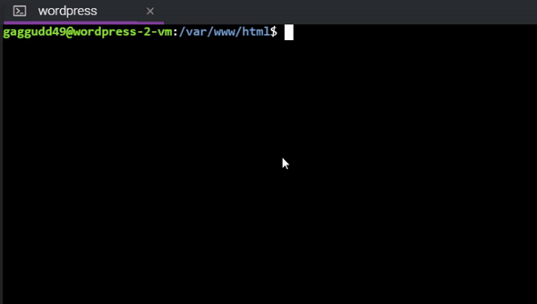
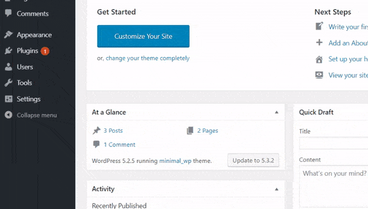

# Code-block-wordpress

---

This is a wordpress plugin used add block to the wordpress editor which provides highlighting to your code. This plugin is built using prism.js library and supports highlighting for `PHP`, `HTML`, `JavaScript`, `SQL` and `CSS`

---

## Why Choose this over others ? 

- Provides a `wordpress code block` in post editor, so instead of adding syntax highlighting to all the `pre` tags inside of `code` tag, it just applies highlighting to code inside `wordpress code block`
- Most of the other syntax highlighters use class names to provide targeted highlighting. But this one registers a new code block in editor.
- Provides well styled code block with line numbers
- Uses Prism.js

---

## Installation

**Download the repository and copy it into the `wp-content/plugins`** 

**Or you can directly clone the repository by executing the following commands** 

- Inside your `wordpress` directory run

  ```bash
  cd ./wp-content/plugins
  ```

- Then clone the repository (you need to have git installed)

  ```bash
  sudo git clone https://github.com/Reepulse/code-block-wordpress.git
  ```

- Login to your `wp-admin` dashboard by visiting 

  ```
  https://your-site-url/wp-admin
  ```

- Then, go to plugins and then activate the `code-block-wordpress` plugin



> Downloading using git

---

## Usage

- You fist need to activate the plugin before you can use any of its features
- After activating the plugin, go to your posts
- Then select edit or add new post
- Click on add block button
- select `code block wordpress`
- Then select Source on the right panel. Example if you want to write `javascript` code  select `javascript code block`
- Write code inside the block and then publish the post
- View the post, you will have highlighted code block with line number



> Usage of the plugin


